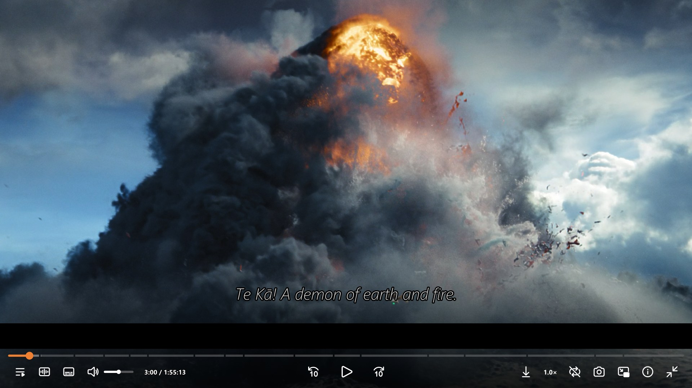

# MPV ModernZ — Highly Customized Config for RTX GPU

A portable, highly customized Windows **mpv** configuration built around **ModernZ** and tuned for NVIDIA RTX GPUs.

## Based on Zabooby's mpv config

This project is **based on and inspired by [Zabooby's mpv-config](https://github.com/Zabooby/mpv-config)**, which focuses on high-quality playback, tuned profiles, shaders, scripts, and a practical viewing experience.

This version keeps that quality-focused foundation while significantly customizing the setup for a modern NVIDIA RTX system, including a refreshed **ModernZ** interface, GPU-focused rendering configuration, and a large streaming cache.

## AI-assisted optimization

This configuration has been **optimized and refined with the help of AI**, with extensive tuning of mpv settings, GPU rendering, hardware decoding, streaming/cache behavior, shaders, subtitle rendering, audio processing, and ModernZ customization.

The goal is to balance **image quality, playback stability, performance, and usability** on NVIDIA RTX hardware.

## Highlights

- 🎨 **ModernZ UI** — modern, customizable playback interface
- 🚀 **RTX optimized** — Vulkan + `gpu-next` + NVDEC
- 💾 **10 GB streaming cache** — larger buffering for supported streaming playback
- 🎬 **4K / HDR playback** — tuned for high-quality video
- 🖼️ **Advanced shaders** — Anime4K, RAVU-Z, NNEDI3, FSRCNNX, ArtCNN and more
- 🔊 **Enhanced audio & subtitles** — custom audio processing and clean subtitle rendering

## Screenshots

<table>
<tr>
<td></td>
<td></td>
</tr>
<tr>
<td></td>
<td></td>
</tr>
</table>

## Requirements

- Windows 10 or Windows 11
- A recent Windows build of mpv
- NVIDIA GPU recommended
- NVIDIA RTX GPU recommended for the included performance tuning
- Current NVIDIA graphics drivers recommended
- Internet connection for streaming features

The configuration may run on other GPUs, but some settings are specifically tuned around NVIDIA RTX hardware and Vulkan.

## Installation

1. Download the latest mpv build and the configuration package from the repository.
2. Extract the MPV portable build.
3. Place the `portable_config` folder beside `mpv.exe`.
4. **Configure the Vulkan GPU name** as described below.
5. Launch `mpv.exe`.

## ⚠️ Important: Set Your GPU Name

The included configuration contains an example Vulkan device entry:

```ini
vulkan-device=NVIDIA GeForce RTX 4050 Laptop GPU
```

**You must change this to match your own GPU** if the name differs.

To see the Vulkan devices detected by mpv, run:

```text
mpv.exe --vulkan-device=help
```

Then copy the exact GPU name reported by mpv into `mpv.conf`:

```ini
vulkan-device=YOUR GPU NAME
```

If you prefer automatic Vulkan device selection, you can remove the `vulkan-device=` line and allow mpv to select the device automatically.

## Streaming Cache

The configuration uses a **10 GB disk-based demuxer cache** for streaming:

```ini
demuxer-cache-dir=C:\mpv-cache
demuxer-max-bytes=10G
demuxer-max-back-bytes=512M
cache-pause=yes
```

This is a **disk cache, not a 10 GB RAM allocation**. The larger cache provides additional buffering headroom for supported streaming playback and can improve seeking/playback stability when network and source conditions allow it.

Make sure the configured cache drive has enough free disk space. You can change the cache location and size to suit your system.

## Configuration Philosophy

This configuration prioritizes **high-quality image processing, smooth playback, HDR support, streaming stability, and a modern interface** while taking advantage of NVIDIA RTX hardware.

It is not intended to enable every available enhancement simultaneously. Expensive shaders and processing options should be selected according to the source resolution, display resolution, refresh rate, and available GPU performance.

## Video & Image Processing

The configuration includes profiles and shaders for different playback scenarios, including:

- Anime4K / Anime4K-based enhancement
- RAVU-Z
- NNEDI3
- FSRCNNX
- ArtCNN
- Debanding
- 4K downscaling
- Sharpening and restoration
- HDR-related processing

Performance varies by GPU, source resolution, display resolution, and shader combination. Avoid stacking multiple expensive upscalers unless your GPU has sufficient headroom.

## Audio

Custom audio processing is included for:

- Stereo playback
- 5.1 downmixing
- 7.1 downmixing
- HRTF/SOFA-based processing
- Audio normalization and playback tuning

## Subtitle Configuration

The default subtitle presentation uses a clean white subtitle style with a black outline for readability across bright and dark scenes.

Subtitle positioning and margins are also integrated with ModernZ's dynamic UI behavior.

## Streaming / yt-dlp

Streaming playback can use mpv's yt-dlp integration for supported websites and services.

Some websites may still return errors such as **HTTP 403** because of site restrictions, signed CDN URLs, authentication requirements, anti-bot systems, or expired media URLs. The 10 GB cache does not bypass these restrictions.

For best compatibility, keep yt-dlp and the mpv build reasonably up to date.

## Credits

- **Base configuration:** [Zabooby/mpv-config](https://github.com/Zabooby/mpv-config)
- **ModernZ:** [Samillion/ModernZ](https://github.com/Samillion/ModernZ)
- **mpv:** [mpv-player/mpv](https://github.com/mpv-player/mpv)

This project is a customized configuration and is not affiliated with Zabooby, Samillion, or the mpv project.

## License / Third-party components

This repository contains third-party scripts, shaders, fonts, and other assets. Their original licenses and attribution should be retained where applicable. Refer to the individual component repositories/files for their respective licensing terms.

## Disclaimer

This is a customized configuration intended primarily for Windows and NVIDIA RTX hardware. Results will vary depending on GPU, display, media source, codecs, drivers, network conditions, and system configuration.
